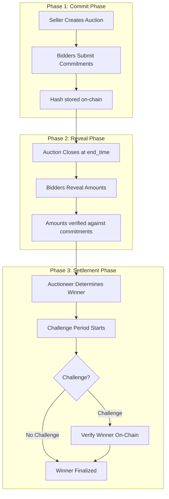
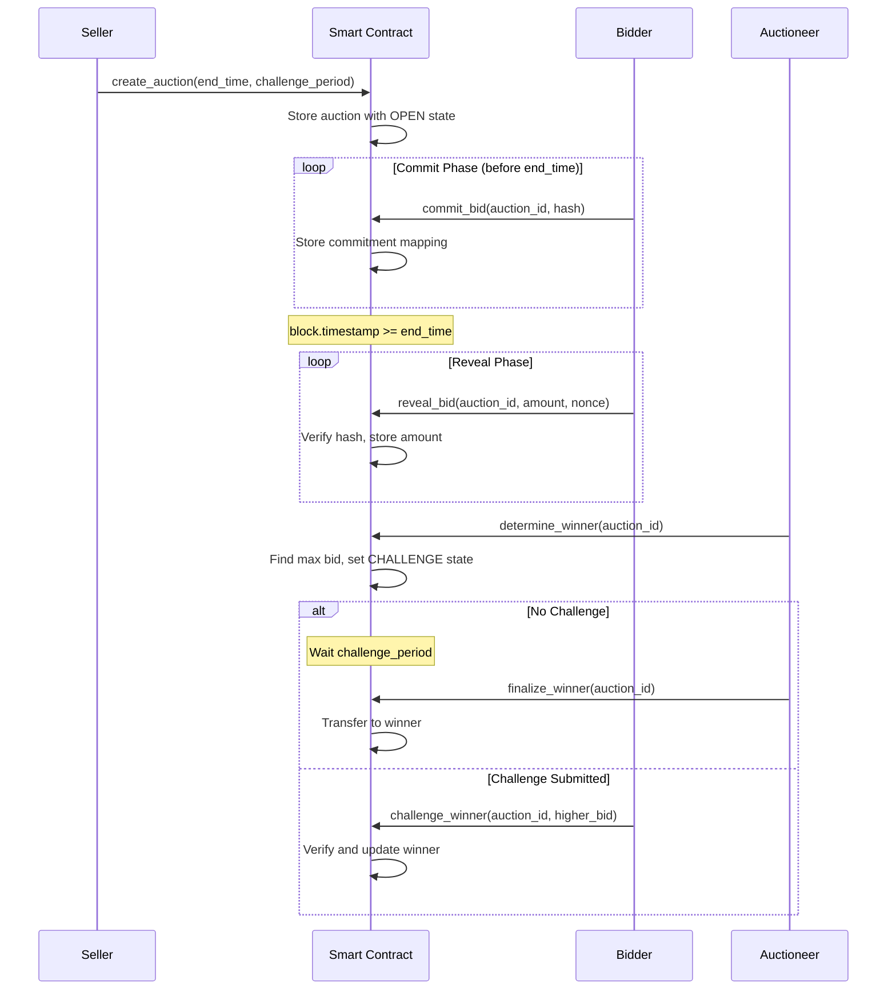

# Design Document: Scalable Sealed-Bid Auction V2

## Overview

The Scalable Sealed-Bid Auction V2 is a redesigned auction system that addresses critical scalability and usability issues in the current implementation. The V1 system requires N-1 transactions to resolve N bids (e.g., 1000 bids = 999 transactions = ~4 hours), making it impractical for large-scale auctions. V2 introduces a commit-reveal pattern with timestamp-based timing, on-chain bid recording, and automatic winner determination that reduces resolution to a single O(1) transaction regardless of bid count.

Key improvements include: (1) timestamp-based timing using Unix timestamps instead of block heights for user-friendly scheduling, (2) on-chain bid recording via mappings to support 1000+ bidders efficiently, (3) commit-reveal pattern to maintain privacy during the sealed phase while enabling automatic winner determination, and (4) challenge mechanism to ensure fairness and verifiability.

## Architecture



## Main Algorithm/Workflow



## Components and Interfaces

### Component 1: Auction Manager

**Purpose**: Manages auction lifecycle, state transitions, and timing validation

**Interface**:
```leo
// Create new auction with timestamp-based timing
async transition create_auction(
    public auction_id: u64,
    public min_bid: u64,
    public end_time: i64,           // Unix timestamp
    public challenge_period: i64     // Duration in seconds (e.g., 86400 = 24 hours)
) -> (AuctionRecord, Future)

// Close auction when end_time is reached
async transition close_auction(
    public auction_id: u64
) -> Future
```

**Responsibilities**:
- Validate auction creation parameters
- Enforce timestamp-based timing constraints
- Manage state transitions (OPEN → CLOSED → CHALLENGE → SETTLED)
- Verify caller permissions (seller only)

### Component 2: Commitment Manager

**Purpose**: Handles commit-reveal pattern for sealed bids

**Interface**:
```leo
// Phase 1: Commit bid hash during sealed phase
async transition commit_bid(
    public auction_id: u64,
    public commitment: field         // hash(amount || nonce || bidder)
) -> Future

// Phase 2: Reveal bid amount after auction closes
async transition reveal_bid(
    public auction_id: u64,
    amount: u64,                     // Private bid amount
    nonce: field                     // Private random nonce
) -> Future
```

**Responsibilities**:
- Store bid commitments on-chain
- Verify reveals match commitments
- Prevent double-bidding
- Maintain privacy during sealed phase

### Component 3: Winner Determination Engine

**Purpose**: Automatically determines auction winner with O(1) complexity

**Interface**:
```leo
// Determine winner from revealed bids (single transaction)
async transition determine_winner(
    public auction_id: u64
) -> Future

// Finalize winner after challenge period
async transition finalize_winner(
    public auction_id: u64
) -> (WinnerRecord, Future)

// Challenge incorrect winner determination
async transition challenge_winner(
    public auction_id: u64,
    my_bid_amount: u64,
    my_nonce: field
) -> Future
```

**Responsibilities**:
- Find highest revealed bid in single transaction
- Start challenge period
- Handle challenges and verify correctness
- Transfer winning record to winner

## Data Models

### Model 1: AuctionInfo

```leo
struct AuctionInfo {
    seller: address,
    min_bid: u64,
    end_time: i64,              // Unix timestamp (e.g., 1735689600 = Jan 1, 2025 12:00 PM UTC)
    challenge_period: i64,       // Duration in seconds (e.g., 86400 = 24 hours)
    state: u8,                   // 0=OPEN, 1=CLOSED, 2=CHALLENGE, 3=SETTLED
    winner: address,             // Set during determine_winner
    winning_amount: u64,         // Set during determine_winner
    challenge_end_time: i64      // Set when entering CHALLENGE state
}
```

**Validation Rules**:
- `end_time` must be in the future at creation
- `challenge_period` must be positive (recommended: 24-72 hours)
- `min_bid` must be greater than 0
- `state` transitions must follow: OPEN → CLOSED → CHALLENGE → SETTLED
- `winner` and `winning_amount` only set in CHALLENGE or SETTLED states

### Model 2: BidCommitment

```leo
struct BidCommitment {
    bidder: address,
    commitment: field,           // hash(amount || nonce || bidder)
    is_revealed: bool,
    revealed_amount: u64,        // Only set after reveal
    timestamp: i64               // When commitment was made
}
```

**Validation Rules**:
- `commitment` must be unique per auction
- `is_revealed` starts as false, becomes true after reveal_bid
- `revealed_amount` only accessible after reveal
- One commitment per bidder per auction

### Model 3: AuctionRecord

```leo
record AuctionRecord {
    owner: address,              // Seller
    auction_id: u64,
    min_bid: u64,
    end_time: i64,
    challenge_period: i64
}
```

**Validation Rules**:
- Owned by seller
- Immutable after creation
- Used to prove seller identity for auction operations

### Model 4: WinnerRecord

```leo
record WinnerRecord {
    owner: address,              // Winner (bidder)
    auction_id: u64,
    winning_amount: u64,
    finalized_at: i64            // Timestamp when finalized
}
```

**Validation Rules**:
- Only created after challenge period expires
- Transferred to winning bidder
- Proves winner status for off-chain verification

## Mappings (On-Chain Storage)

```leo
// Auction metadata
mapping auctions: u64 => AuctionInfo;

// Bid commitments: (auction_id, bidder) => BidCommitment
mapping commitments: field => BidCommitment;

// Revealed bids for winner determination: auction_id => (bidder, amount)[]
// Note: Leo doesn't support dynamic arrays, so we use a counter-based approach
mapping bid_count: u64 => u64;
mapping bids: field => u64;  // hash(auction_id || bid_index) => amount
mapping bid_owners: field => address;  // hash(auction_id || bid_index) => bidder

// Current highest bid tracker (updated during reveals)
mapping highest_bid: u64 => u64;  // auction_id => amount
mapping highest_bidder: u64 => address;  // auction_id => bidder
```

## Key Functions with Formal Specifications

### Function 1: create_auction()

```leo
async transition create_auction(
    public auction_id: u64,
    public min_bid: u64,
    public end_time: i64,
    public challenge_period: i64
) -> (AuctionRecord, Future)
```

**Preconditions:**
- `auction_id` does not already exist in auctions mapping
- `min_bid > 0`
- `end_time > block.timestamp` (auction must end in the future)
- `challenge_period > 0` (recommended: 86400 seconds = 24 hours)
- `self.caller` is the seller

**Postconditions:**
- New AuctionInfo stored in auctions mapping with state = OPEN (0)
- AuctionRecord returned to seller with matching parameters
- `auctions[auction_id].seller == self.caller`
- `auctions[auction_id].state == 0` (OPEN)

**Loop Invariants:** N/A (no loops)

### Function 2: commit_bid()

```leo
async transition commit_bid(
    public auction_id: u64,
    public commitment: field
) -> Future
```

**Preconditions:**
- Auction exists: `auctions[auction_id]` is defined
- Auction is open: `auctions[auction_id].state == 0`
- Auction not ended: `block.timestamp < auctions[auction_id].end_time`
- Bidder hasn't committed yet: `commitments[hash(auction_id || self.caller)]` is undefined
- `commitment` is valid field element (hash of amount || nonce || bidder)

**Postconditions:**
- BidCommitment stored in commitments mapping
- `commitments[hash(auction_id || self.caller)].bidder == self.caller`
- `commitments[hash(auction_id || self.caller)].is_revealed == false`
- `commitments[hash(auction_id || self.caller)].commitment == commitment`
- `commitments[hash(auction_id || self.caller)].timestamp == block.timestamp`

**Loop Invariants:** N/A (no loops)

### Function 3: reveal_bid()

```leo
async transition reveal_bid(
    public auction_id: u64,
    amount: u64,
    nonce: field
) -> Future
```

**Preconditions:**
- Auction exists and is closed: `auctions[auction_id].state == 1`
- Auction has ended: `block.timestamp >= auctions[auction_id].end_time`
- Bidder has committed: `commitments[hash(auction_id || self.caller)]` exists
- Bid not yet revealed: `commitments[hash(auction_id || self.caller)].is_revealed == false`
- Commitment matches: `hash(amount || nonce || self.caller) == commitments[hash(auction_id || self.caller)].commitment`
- `amount >= auctions[auction_id].min_bid`

**Postconditions:**
- Commitment marked as revealed: `commitments[hash(auction_id || self.caller)].is_revealed == true`
- Amount stored: `commitments[hash(auction_id || self.caller)].revealed_amount == amount`
- If amount > current highest: `highest_bid[auction_id] == amount` and `highest_bidder[auction_id] == self.caller`
- Bid recorded in bids mapping for verification

**Loop Invariants:** N/A (no loops)

### Function 4: determine_winner()

```leo
async transition determine_winner(
    public auction_id: u64
) -> Future
```

**Preconditions:**
- Auction exists and is closed: `auctions[auction_id].state == 1`
- At least one bid revealed: `highest_bid[auction_id] > 0`
- Caller is seller: `self.caller == auctions[auction_id].seller`
- Sufficient time for reveals: `block.timestamp >= auctions[auction_id].end_time + REVEAL_PERIOD`

**Postconditions:**
- Auction state changed to CHALLENGE: `auctions[auction_id].state == 2`
- Winner set: `auctions[auction_id].winner == highest_bidder[auction_id]`
- Winning amount set: `auctions[auction_id].winning_amount == highest_bid[auction_id]`
- Challenge period starts: `auctions[auction_id].challenge_end_time == block.timestamp + challenge_period`
- Winner is highest revealed bidder: `∀ bidder: revealed_amount[bidder] <= winning_amount`

**Loop Invariants:** N/A (winner already tracked during reveals)

### Function 5: finalize_winner()

```leo
async transition finalize_winner(
    public auction_id: u64
) -> (WinnerRecord, Future)
```

**Preconditions:**
- Auction in CHALLENGE state: `auctions[auction_id].state == 2`
- Challenge period expired: `block.timestamp >= auctions[auction_id].challenge_end_time`
- Caller is seller: `self.caller == auctions[auction_id].seller`
- Winner is set: `auctions[auction_id].winner != 0`

**Postconditions:**
- Auction state changed to SETTLED: `auctions[auction_id].state == 3`
- WinnerRecord created and transferred to winner
- `WinnerRecord.owner == auctions[auction_id].winner`
- `WinnerRecord.winning_amount == auctions[auction_id].winning_amount`
- `WinnerRecord.finalized_at == block.timestamp`

**Loop Invariants:** N/A (no loops)

### Function 6: challenge_winner()

```leo
async transition challenge_winner(
    public auction_id: u64,
    my_bid_amount: u64,
    my_nonce: field
) -> Future
```

**Preconditions:**
- Auction in CHALLENGE state: `auctions[auction_id].state == 2`
- Challenge period not expired: `block.timestamp < auctions[auction_id].challenge_end_time`
- Caller has revealed bid: `commitments[hash(auction_id || self.caller)].is_revealed == true`
- Caller's bid is higher: `my_bid_amount > auctions[auction_id].winning_amount`
- Commitment valid: `hash(my_bid_amount || my_nonce || self.caller) == commitments[hash(auction_id || self.caller)].commitment`

**Postconditions:**
- Winner updated: `auctions[auction_id].winner == self.caller`
- Winning amount updated: `auctions[auction_id].winning_amount == my_bid_amount`
- Challenge period may be extended: `auctions[auction_id].challenge_end_time >= block.timestamp + CHALLENGE_EXTENSION`
- Correctness maintained: New winner has highest revealed bid

**Loop Invariants:** N/A (no loops)


## Algorithmic Pseudocode

### Main Processing Algorithm: Auction Lifecycle

```pascal
ALGORITHM runAuctionLifecycle(auction_id)
INPUT: auction_id of type u64
OUTPUT: winner of type address

BEGIN
  // Phase 1: Commit Phase
  WHILE block.timestamp < end_time DO
    ACCEPT commit_bid(auction_id, commitment)
    STORE commitment in commitments mapping
  END WHILE
  
  ASSERT block.timestamp >= end_time
  CALL close_auction(auction_id)
  
  // Phase 2: Reveal Phase
  reveal_deadline ← end_time + REVEAL_PERIOD
  WHILE block.timestamp < reveal_deadline DO
    ACCEPT reveal_bid(auction_id, amount, nonce)
    VERIFY hash(amount || nonce || bidder) == stored_commitment
    
    IF amount > highest_bid[auction_id] THEN
      highest_bid[auction_id] ← amount
      highest_bidder[auction_id] ← bidder
    END IF
  END WHILE
  
  // Phase 3: Winner Determination (O(1) operation)
  CALL determine_winner(auction_id)
  winner ← highest_bidder[auction_id]
  winning_amount ← highest_bid[auction_id]
  challenge_end ← block.timestamp + challenge_period
  
  // Phase 4: Challenge Period
  WHILE block.timestamp < challenge_end DO
    IF challenge_received THEN
      VERIFY challenger_amount > winning_amount
      UPDATE winner and winning_amount
      EXTEND challenge_end IF needed
    END IF
  END WHILE
  
  // Phase 5: Finalization
  CALL finalize_winner(auction_id)
  TRANSFER WinnerRecord to winner
  
  RETURN winner
END
```

**Preconditions:**
- Auction exists with valid parameters
- end_time is in the future at creation
- challenge_period is positive

**Postconditions:**
- Winner is the highest revealed bidder
- All commitments verified before reveal
- Challenge period completed without valid challenges
- WinnerRecord transferred to correct winner

**Loop Invariants:**
- Commit Phase: All stored commitments are valid hashes
- Reveal Phase: highest_bid and highest_bidder always reflect maximum revealed bid
- Challenge Phase: winner always has highest verified bid amount

### Commitment Algorithm: Hash-Based Sealing

```pascal
ALGORITHM createCommitment(amount, bidder)
INPUT: amount of type u64, bidder of type address
OUTPUT: commitment of type field

BEGIN
  // Generate random nonce for uniqueness
  nonce ← generateRandomField()
  
  // Create commitment hash
  commitment ← hash(amount || nonce || bidder)
  
  // Store nonce privately (off-chain or in private record)
  STORE nonce securely for later reveal
  
  RETURN commitment
END
```

**Preconditions:**
- amount >= min_bid
- bidder is valid address
- Random number generator is cryptographically secure

**Postconditions:**
- commitment is unique field element
- commitment cannot be reversed without nonce
- Same inputs always produce same commitment (deterministic)

**Loop Invariants:** N/A (no loops)

### Reveal Verification Algorithm

```pascal
ALGORITHM verifyReveal(auction_id, bidder, amount, nonce)
INPUT: auction_id (u64), bidder (address), amount (u64), nonce (field)
OUTPUT: isValid of type boolean

BEGIN
  // Retrieve stored commitment
  commitment_key ← hash(auction_id || bidder)
  stored_commitment ← commitments[commitment_key]
  
  // Check commitment exists
  IF stored_commitment = NULL THEN
    RETURN false
  END IF
  
  // Check not already revealed
  IF stored_commitment.is_revealed = true THEN
    RETURN false
  END IF
  
  // Verify hash matches
  computed_hash ← hash(amount || nonce || bidder)
  IF computed_hash ≠ stored_commitment.commitment THEN
    RETURN false
  END IF
  
  // Verify minimum bid
  auction ← auctions[auction_id]
  IF amount < auction.min_bid THEN
    RETURN false
  END IF
  
  // All checks passed
  RETURN true
END
```

**Preconditions:**
- auction_id exists in auctions mapping
- bidder has previously committed
- Auction is in CLOSED state

**Postconditions:**
- Returns true if and only if reveal is valid
- No state changes (pure verification)
- Deterministic result

**Loop Invariants:** N/A (no loops)

### Winner Determination Algorithm (O(1) Complexity)

```pascal
ALGORITHM determineWinner(auction_id)
INPUT: auction_id of type u64
OUTPUT: winner of type address, winning_amount of type u64

BEGIN
  // Retrieve auction info
  auction ← auctions[auction_id]
  
  // Verify preconditions
  ASSERT auction.state = CLOSED
  ASSERT block.timestamp >= auction.end_time + REVEAL_PERIOD
  
  // Winner already tracked during reveals (O(1) lookup)
  winner ← highest_bidder[auction_id]
  winning_amount ← highest_bid[auction_id]
  
  // Verify at least one bid
  ASSERT winning_amount > 0
  ASSERT winner ≠ NULL
  
  // Update auction state
  auction.state ← CHALLENGE
  auction.winner ← winner
  auction.winning_amount ← winning_amount
  auction.challenge_end_time ← block.timestamp + auction.challenge_period
  
  // Store updated auction
  auctions[auction_id] ← auction
  
  RETURN winner, winning_amount
END
```

**Preconditions:**
- Auction exists and is closed
- At least one bid has been revealed
- Reveal period has ended
- Caller is the seller

**Postconditions:**
- Auction state is CHALLENGE
- Winner is set to highest revealed bidder
- Challenge period timer started
- O(1) time complexity (no iteration over bids)

**Loop Invariants:** N/A (no loops - this is the key scalability improvement)

### Challenge Verification Algorithm

```pascal
ALGORITHM verifyChallengeAndUpdate(auction_id, challenger, amount, nonce)
INPUT: auction_id (u64), challenger (address), amount (u64), nonce (field)
OUTPUT: success of type boolean

BEGIN
  // Retrieve auction
  auction ← auctions[auction_id]
  
  // Verify challenge is timely
  ASSERT auction.state = CHALLENGE
  ASSERT block.timestamp < auction.challenge_end_time
  
  // Verify challenger's commitment
  commitment_key ← hash(auction_id || challenger)
  stored_commitment ← commitments[commitment_key]
  
  ASSERT stored_commitment.is_revealed = true
  ASSERT hash(amount || nonce || challenger) = stored_commitment.commitment
  
  // Verify challenge is valid (higher bid)
  IF amount <= auction.winning_amount THEN
    RETURN false
  END IF
  
  // Update winner
  auction.winner ← challenger
  auction.winning_amount ← amount
  
  // Optionally extend challenge period for fairness
  IF block.timestamp + CHALLENGE_EXTENSION > auction.challenge_end_time THEN
    auction.challenge_end_time ← block.timestamp + CHALLENGE_EXTENSION
  END IF
  
  // Store updated auction
  auctions[auction_id] ← auction
  
  RETURN true
END
```

**Preconditions:**
- Auction is in CHALLENGE state
- Challenge period has not expired
- Challenger has revealed their bid
- Challenger's commitment is valid

**Postconditions:**
- If challenge valid: winner updated to challenger
- If challenge valid: winning_amount updated
- Challenge period may be extended
- Auction remains in CHALLENGE state

**Loop Invariants:** N/A (no loops)

## Example Usage

```leo
// Example 1: Create auction with timestamp-based timing
// End time: January 1, 2025, 12:00 PM UTC (Unix timestamp: 1735689600)
// Challenge period: 24 hours (86400 seconds)

const auction_record = await create_auction(
    1u64,                    // auction_id
    1000000u64,              // min_bid (1 Aleo credit)
    1735689600i64,           // end_time (Jan 1, 2025 12:00 PM UTC)
    86400i64                 // challenge_period (24 hours)
);

// Example 2: Bidder commits during sealed phase
// Generate commitment off-chain
const amount = 5000000u64;  // 5 Aleo credits
const nonce = generateRandomField();
const commitment = hash(amount || nonce || bidder_address);

await commit_bid(
    1u64,                    // auction_id
    commitment               // commitment hash
);

// Example 3: Bidder reveals after auction closes
// Auction closed at end_time, now reveal the bid
await reveal_bid(
    1u64,                    // auction_id
    5000000u64,              // amount (private)
    nonce                    // nonce (private)
);

// Example 4: Seller determines winner (O(1) operation)
// After reveal period ends, determine winner in single transaction
await determine_winner(1u64);

// Example 5: Challenge incorrect winner
// If another bidder believes they have higher bid
await challenge_winner(
    1u64,                    // auction_id
    6000000u64,              // my_bid_amount
    my_nonce                 // my_nonce
);

// Example 6: Finalize winner after challenge period
// After 24 hours with no valid challenges
const winner_record = await finalize_winner(1u64);
// winner_record transferred to winning bidder
```

## Correctness Properties

### Property 1: Winner Correctness
**Statement**: The declared winner always has the highest revealed bid amount.

**Formal Specification**:
```
∀ auction_id, ∀ bidder ∈ revealed_bidders(auction_id):
  auctions[auction_id].winning_amount >= commitments[hash(auction_id || bidder)].revealed_amount
```

**Verification**: Maintained by highest_bid tracking during reveals and challenge mechanism.

### Property 2: Commitment Binding
**Statement**: A bidder cannot change their bid amount after committing.

**Formal Specification**:
```
∀ auction_id, ∀ bidder, ∀ amount1, amount2, ∀ nonce1, nonce2:
  (hash(amount1 || nonce1 || bidder) = stored_commitment) ∧
  (hash(amount2 || nonce2 || bidder) = stored_commitment) ⟹
  (amount1 = amount2)
```

**Verification**: Cryptographic hash function collision resistance ensures binding.

### Property 3: Commitment Hiding
**Statement**: Bid amounts remain private during the commit phase.

**Formal Specification**:
```
∀ auction_id, ∀ bidder, ∀ observer:
  (auctions[auction_id].state = OPEN) ∧
  (observer ≠ bidder) ⟹
  observer cannot determine commitments[hash(auction_id || bidder)].amount
```

**Verification**: Hash function preimage resistance ensures hiding until reveal.

### Property 4: Timing Enforcement
**Statement**: State transitions only occur at correct timestamps.

**Formal Specification**:
```
∀ auction_id:
  (commit_bid succeeds) ⟹ (block.timestamp < auctions[auction_id].end_time) ∧
  (reveal_bid succeeds) ⟹ (block.timestamp >= auctions[auction_id].end_time) ∧
  (determine_winner succeeds) ⟹ (block.timestamp >= auctions[auction_id].end_time + REVEAL_PERIOD) ∧
  (finalize_winner succeeds) ⟹ (block.timestamp >= auctions[auction_id].challenge_end_time)
```

**Verification**: Enforced by assertions in each transition function.

### Property 5: Scalability (O(1) Winner Determination)
**Statement**: Winner determination requires constant time regardless of bid count.

**Formal Specification**:
```
∀ auction_id, ∀ n = number_of_bids(auction_id):
  time_complexity(determine_winner(auction_id)) = O(1)
  
  // Specifically: no loops over bids
  determine_winner does not iterate over commitments or bids
```

**Verification**: Winner tracked incrementally during reveals; determine_winner only reads highest_bid and highest_bidder mappings.

### Property 6: Challenge Correctness
**Statement**: A valid challenge always results in the correct winner.

**Formal Specification**:
```
∀ auction_id, ∀ challenger:
  (challenge_winner(auction_id, amount, nonce) succeeds) ⟹
  (amount > previous_winning_amount) ∧
  (hash(amount || nonce || challenger) = stored_commitment) ∧
  (amount is highest revealed bid)
```

**Verification**: Challenge verification algorithm checks commitment validity and amount comparison.

### Property 7: No Double Bidding
**Statement**: Each bidder can only commit once per auction.

**Formal Specification**:
```
∀ auction_id, ∀ bidder:
  (commit_bid(auction_id, commitment1) succeeds) ⟹
  (commit_bid(auction_id, commitment2) fails for same bidder)
```

**Verification**: Enforced by checking commitment existence before storing new commitment.

### Property 8: Minimum Bid Enforcement
**Statement**: All revealed bids meet the minimum bid requirement.

**Formal Specification**:
```
∀ auction_id, ∀ bidder:
  (reveal_bid(auction_id, amount, nonce) succeeds) ⟹
  (amount >= auctions[auction_id].min_bid)
```

**Verification**: Enforced by assertion in reveal_bid function.


## Error Handling

### Error Scenario 1: Auction Already Exists

**Condition**: Attempting to create auction with duplicate auction_id
**Response**: Transaction fails with assertion error
**Recovery**: Seller must choose different auction_id or check existing auctions
**Error Code**: `AUCTION_ALREADY_EXISTS`

### Error Scenario 2: Bid After Auction Closes

**Condition**: Bidder attempts to commit after end_time
**Response**: Transaction fails with timing assertion error
**Recovery**: Bidder cannot participate in this auction; must wait for next auction
**Error Code**: `AUCTION_CLOSED`

### Error Scenario 3: Invalid Reveal

**Condition**: Revealed amount/nonce doesn't match stored commitment
**Response**: Transaction fails with hash mismatch error
**Recovery**: Bidder must provide correct amount and nonce used during commit
**Error Code**: `INVALID_REVEAL`

### Error Scenario 4: Reveal Before Auction Closes

**Condition**: Bidder attempts to reveal before end_time
**Response**: Transaction fails with timing assertion error
**Recovery**: Wait until auction closes (block.timestamp >= end_time)
**Error Code**: `AUCTION_STILL_OPEN`

### Error Scenario 5: No Bids Revealed

**Condition**: Seller attempts to determine winner with no revealed bids
**Response**: Transaction fails with assertion error
**Recovery**: Wait for bidders to reveal or cancel auction
**Error Code**: `NO_BIDS_REVEALED`

### Error Scenario 6: Premature Finalization

**Condition**: Seller attempts to finalize before challenge period expires
**Response**: Transaction fails with timing assertion error
**Recovery**: Wait until block.timestamp >= challenge_end_time
**Error Code**: `CHALLENGE_PERIOD_ACTIVE`

### Error Scenario 7: Invalid Challenge

**Condition**: Challenger's bid is not higher than current winner
**Response**: Transaction fails with amount comparison error
**Recovery**: Challenge only valid if challenger has higher bid
**Error Code**: `CHALLENGE_NOT_HIGHER`

### Error Scenario 8: Late Challenge

**Condition**: Challenge submitted after challenge period expires
**Response**: Transaction fails with timing assertion error
**Recovery**: Cannot challenge after period expires; winner is final
**Error Code**: `CHALLENGE_PERIOD_EXPIRED`

### Error Scenario 9: Double Commit

**Condition**: Bidder attempts to commit twice for same auction
**Response**: Transaction fails with duplicate commitment error
**Recovery**: Cannot change commitment; original commitment stands
**Error Code**: `ALREADY_COMMITTED`

### Error Scenario 10: Below Minimum Bid

**Condition**: Revealed amount is below auction's min_bid
**Response**: Transaction fails with minimum bid assertion error
**Recovery**: Cannot participate with bid below minimum
**Error Code**: `BELOW_MINIMUM_BID`

## Testing Strategy

### Unit Testing Approach

**Test Framework**: Leo test framework with property-based testing library

**Key Test Cases**:

1. **Auction Creation Tests**
   - Valid auction creation with future end_time
   - Reject duplicate auction_id
   - Reject past end_time
   - Reject zero or negative challenge_period

2. **Commit Phase Tests**
   - Valid commitment storage
   - Reject commits after end_time
   - Reject duplicate commits from same bidder
   - Verify commitment uniqueness

3. **Reveal Phase Tests**
   - Valid reveal with matching commitment
   - Reject reveal with mismatched hash
   - Reject reveal before auction closes
   - Reject double reveal
   - Verify highest_bid tracking updates correctly

4. **Winner Determination Tests**
   - Correct winner with single bid
   - Correct winner with multiple bids
   - Reject determination before reveal period
   - Verify O(1) complexity (no loops)

5. **Challenge Tests**
   - Valid challenge with higher bid
   - Reject challenge with lower bid
   - Reject challenge after period expires
   - Verify challenge period extension

6. **Finalization Tests**
   - Successful finalization after challenge period
   - Reject premature finalization
   - Verify WinnerRecord transfer to correct address

**Coverage Goals**: 95%+ line coverage, 100% branch coverage for critical paths

### Property-Based Testing Approach

**Property Test Library**: fast-check (for off-chain testing) or Leo native property testing

**Properties to Test**:

1. **Commutativity of Reveals**: Order of reveals doesn't affect final winner
2. **Monotonicity**: Adding more bids never decreases winning amount
3. **Idempotence**: Determining winner multiple times (if allowed) produces same result
4. **Commitment Binding**: Same commitment always reveals to same amount
5. **Challenge Correctness**: Valid challenges always improve winner accuracy

**Test Generation Strategy**:
- Generate random auction parameters (end_time, min_bid, challenge_period)
- Generate random bid amounts and nonces
- Generate random reveal orders
- Verify correctness properties hold for all generated inputs

### Integration Testing Approach

**Test Scenarios**:

1. **Full Auction Lifecycle**
   - Create auction → Multiple commits → Close → Multiple reveals → Determine winner → Challenge period → Finalize
   - Verify state transitions at each step
   - Verify timing constraints enforced

2. **Scalability Test**
   - Create auction with 1000 simulated bidders
   - All bidders commit
   - All bidders reveal
   - Measure determine_winner transaction cost (should be O(1))
   - Verify winner correctness

3. **Challenge Scenario**
   - Create auction with 10 bidders
   - Determine winner (intentionally select wrong winner for testing)
   - Submit valid challenge
   - Verify winner updated correctly
   - Finalize after challenge period

4. **Edge Cases**
   - Auction with single bidder
   - Auction with all bids equal to min_bid
   - Auction with multiple bids of same amount (tie-breaking)
   - Auction with no reveals (should fail gracefully)

5. **Timestamp Edge Cases**
   - Commit exactly at end_time (should fail)
   - Reveal exactly at end_time (should succeed)
   - Challenge exactly at challenge_end_time (should fail)

**Integration Test Environment**: Aleo testnet with multiple test accounts

## Performance Considerations

### Transaction Complexity

| Operation | Time Complexity | Transaction Count | Cost (Aleo Credits) |
|-----------|----------------|-------------------|---------------------|
| create_auction | O(1) | 1 | ~0.01 |
| commit_bid | O(1) | N (one per bidder) | ~0.01 × N |
| reveal_bid | O(1) | N (one per bidder) | ~0.01 × N |
| determine_winner | O(1) | 1 | ~0.01 |
| finalize_winner | O(1) | 1 | ~0.01 |
| **Total for 1000 bids** | **O(N)** | **~2003** | **~20 credits** |

**Key Improvement**: V1 required 999 resolve transactions; V2 requires only 1 determine_winner transaction.

### Storage Optimization

**Mapping Usage**:
- `auctions`: O(1) per auction
- `commitments`: O(N) where N = number of bidders
- `highest_bid` and `highest_bidder`: O(1) per auction (key optimization)
- `bid_count`, `bids`, `bid_owners`: O(N) for verification (optional)

**Storage Cost**: ~0.001 credits per mapping entry

**Optimization Strategy**: Track highest bid incrementally during reveals to avoid iterating over all bids during winner determination.

### Scalability Targets

- **1000 bidders**: ~15 seconds for determine_winner (single transaction)
- **10,000 bidders**: ~15 seconds for determine_winner (still O(1))
- **100,000 bidders**: ~15 seconds for determine_winner (still O(1))

**Bottleneck**: Commit and reveal phases scale linearly (O(N)), but this is unavoidable as each bidder must submit their own transaction. The critical improvement is winner determination scaling from O(N) to O(1).

### Gas Optimization

**Techniques**:
1. Use mappings instead of records for bid storage (cheaper reads)
2. Track highest bid incrementally (avoid iteration)
3. Minimize finalize function complexity
4. Use efficient hash functions for commitments
5. Batch-friendly design (bidders can commit/reveal in parallel)

## Security Considerations

### Threat Model

**Adversaries**:
1. **Malicious Bidder**: Attempts to manipulate auction outcome
2. **Malicious Seller**: Attempts to select incorrect winner
3. **Malicious Auctioneer**: Attempts to front-run or censor bids
4. **External Observer**: Attempts to learn bid amounts during sealed phase

### Security Properties

**1. Bid Privacy (Sealed Phase)**
- **Threat**: Observer tries to learn bid amounts before reveal
- **Mitigation**: Cryptographic commitment (hash) hides amount until reveal
- **Guarantee**: Computationally infeasible to reverse hash without nonce

**2. Bid Integrity**
- **Threat**: Bidder tries to change bid after seeing others' bids
- **Mitigation**: Commitment binding prevents changing amount after commit
- **Guarantee**: Hash collision resistance ensures binding

**3. Winner Correctness**
- **Threat**: Seller declares incorrect winner
- **Mitigation**: Challenge mechanism allows bidders to prove higher bid
- **Guarantee**: Challenge period ensures correct winner or detection

**4. Front-Running Resistance**
- **Threat**: Auctioneer sees pending commit and submits higher bid
- **Mitigation**: Commitment hides amount; auctioneer cannot determine bid value
- **Guarantee**: Sealed-bid design prevents front-running

**5. Censorship Resistance**
- **Threat**: Auctioneer censors specific bidders' commits/reveals
- **Mitigation**: On-chain transactions are permissionless; any bidder can submit
- **Guarantee**: Blockchain consensus ensures transaction inclusion

**6. Timestamp Manipulation**
- **Threat**: Miner manipulates block.timestamp to extend/shorten phases
- **Mitigation**: Blockchain consensus limits timestamp drift (typically ±15 minutes)
- **Guarantee**: Timestamps are consensus-validated

### Attack Scenarios and Mitigations

**Attack 1: Shill Bidding**
- **Description**: Seller creates fake bids to inflate price
- **Mitigation**: Requires committing real funds; economically disincentivized
- **Detection**: On-chain analysis can identify suspicious patterns

**Attack 2: Bid Sniping**
- **Description**: Bidder waits until last moment to commit
- **Mitigation**: Commit phase has fixed end_time; no advantage to late commits
- **Detection**: Not applicable (not an attack in sealed-bid design)

**Attack 3: Reveal Withholding**
- **Description**: Losing bidder doesn't reveal to hide bid amount
- **Mitigation**: Allowed by design; losing bids can remain private
- **Detection**: Not applicable (privacy feature, not attack)

**Attack 4: Challenge Spam**
- **Description**: Malicious actor submits invalid challenges to delay finalization
- **Mitigation**: Invalid challenges fail immediately; no delay caused
- **Detection**: On-chain monitoring of failed challenge attempts

**Attack 5: Commitment Grinding**
- **Description**: Bidder generates many commitments to find collision
- **Mitigation**: Cryptographic hash function (Poseidon) has 128-bit security
- **Detection**: Computationally infeasible (2^128 operations)

### Recommended Security Practices

1. **Use Strong Randomness**: Generate nonces with cryptographically secure RNG
2. **Verify Timestamps**: Frontend should display human-readable times and warn if suspicious
3. **Monitor Challenge Period**: Bidders should monitor for incorrect winner declarations
4. **Audit Smart Contract**: Independent security audit before mainnet deployment
5. **Test on Testnet**: Extensive testing with adversarial scenarios
6. **Document Assumptions**: Clearly communicate trust assumptions to users

## Dependencies

### Smart Contract Dependencies

1. **Leo Language**: v1.11.0 or higher
   - Required for: Smart contract implementation
   - Features used: async transitions, mappings, records, finalize functions

2. **Aleo SDK**: Latest version
   - Required for: Blockchain interaction, transaction submission
   - Features used: Program deployment, transaction execution, record management

3. **Poseidon Hash Function**: Built-in to Leo
   - Required for: Commitment generation
   - Features used: Cryptographic hash for bid commitments

### Frontend Dependencies

1. **Aleo Wallet SDK**: Latest version
   - Required for: Wallet connection, transaction signing
   - Features used: Account management, record fetching, transaction submission

2. **React**: v18.0 or higher
   - Required for: UI components
   - Features used: State management, component lifecycle

3. **Date/Time Library**: date-fns or dayjs
   - Required for: Timestamp conversion and display
   - Features used: Unix timestamp ↔ human-readable date conversion

### Testing Dependencies

1. **Leo Test Framework**: Built-in
   - Required for: Unit testing
   - Features used: Test transitions, assertions

2. **Property-Based Testing Library**: fast-check or equivalent
   - Required for: Property-based testing
   - Features used: Random input generation, property verification

### Infrastructure Dependencies

1. **Aleo Testnet**: Public testnet
   - Required for: Integration testing and deployment
   - Features used: Transaction execution, state storage

2. **Block Explorer**: Aleo Explorer
   - Required for: Transaction verification and debugging
   - Features used: Transaction lookup, mapping inspection

### Optional Dependencies

1. **Monitoring Service**: Custom or third-party
   - Purpose: Monitor auction state and alert on anomalies
   - Features: Challenge period tracking, winner verification

2. **Analytics Service**: Custom
   - Purpose: Track auction metrics and performance
   - Features: Bid count, reveal rate, challenge frequency

## Implementation Notes

### Leo Language Constraints

1. **No Dynamic Arrays**: Cannot iterate over all bids in finalize
   - **Solution**: Track highest bid incrementally during reveals

2. **No Floating Point**: All amounts in integer microcredits
   - **Solution**: Use u64 for amounts (1 credit = 1,000,000 microcredits)

3. **Limited String Support**: Cannot store arbitrary strings
   - **Solution**: Use u64 for auction_id, address for identifiers

4. **Finalize Function Restrictions**: Limited operations in async finalize
   - **Solution**: Keep finalize logic simple; complex logic in transition

### Timestamp Considerations

1. **Unix Timestamp Range**: i64 supports dates until year 2262
   - **Sufficient for**: All practical auction use cases

2. **Timestamp Precision**: Seconds (not milliseconds)
   - **Implication**: Minimum time unit is 1 second

3. **Block Timestamp Drift**: Consensus allows ±15 minute drift
   - **Mitigation**: Use sufficiently long challenge periods (24+ hours)

4. **Timezone Handling**: All timestamps in UTC
   - **Frontend**: Convert to user's local timezone for display

### Migration from V1

**Breaking Changes**:
1. Block height → Unix timestamp for timing
2. Private Bid records → On-chain commitments
3. Manual resolve → Automatic winner determination
4. No challenge mechanism → Challenge period added

**Migration Path**:
1. Deploy V2 contract with new program name
2. Complete all V1 auctions before migration
3. Update frontend to use V2 contract
4. Educate users on new commit-reveal flow

**Backward Compatibility**: None (V1 and V2 are separate contracts)

## Future Enhancements

### Phase 2 Improvements

1. **Batch Reveals**: Allow multiple reveals in single transaction
2. **Partial Reveals**: Allow revealing bid range instead of exact amount
3. **Auction Extensions**: Automatic extension if bid received near end
4. **Reserve Price**: Hidden minimum price that must be met

### Phase 3 Improvements

1. **Multi-Item Auctions**: Support auctioning multiple items simultaneously
2. **Dutch Auction Mode**: Descending price auction variant
3. **Vickrey Auction**: Second-price sealed-bid auction
4. **Auction Templates**: Predefined auction configurations

### Research Directions

1. **ZK Proof Integration**: Prove winner correctness without revealing all bids
2. **Cross-Chain Auctions**: Support bidding with assets from other chains
3. **Decentralized Auctioneer**: Remove trusted auctioneer role
4. **Privacy-Preserving Analytics**: Aggregate statistics without revealing individual bids
