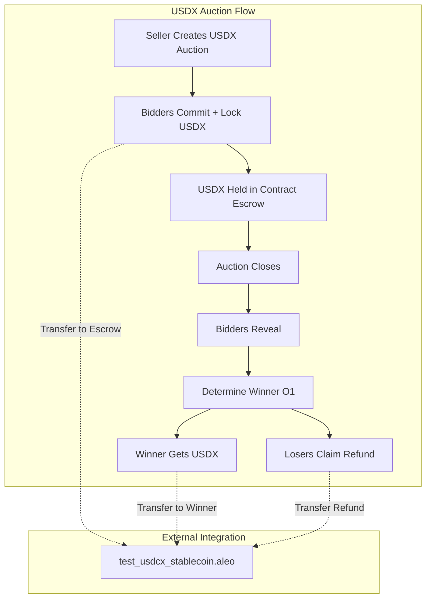
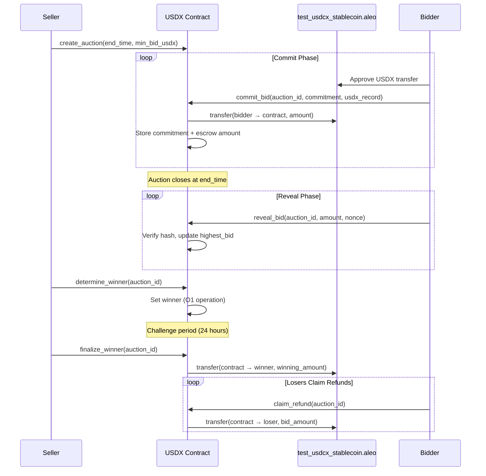

# Design Document: USDX Auction Integration (Phase 2)

## Overview

USDX Auction Integration extends the Scalable Sealed-Bid Auction V2 to support USDX stablecoin bidding via the `test_usdcx_stablecoin.aleo` token contract. This is implemented as a separate contract (`shadowbid_marketplace_v2_usdx.aleo`) that mirrors the core V2 architecture while adding token escrow, transfer, and refund mechanisms.

Key features: (1) Separate contract for USDX to isolate token complexity from native ALEO auctions, (2) Token escrow system where contract holds USDX during auction lifecycle, (3) Automatic winner payment and manual loser refunds for gas efficiency, (4) Full compatibility with commit-reveal pattern and O(1) winner determination from V2.

## Architecture



## Main Algorithm/Workflow



## Components and Interfaces

### Component 1: USDX Auction Manager

**Purpose**: Manages USDX auction lifecycle with token escrow

**Interface**:
```leo
async transition create_auction(
    public auction_id: u64,
    public min_bid_usdx: u64,      // Minimum bid in USDX microcredits
    public end_time: i64,
    public challenge_period: i64
) -> (AuctionRecord, Future)
```


**Responsibilities**:
- Create USDX-denominated auctions
- Validate USDX amounts and timing
- Track auction state transitions

### Component 2: USDX Escrow Manager

**Purpose**: Handles USDX token locking, holding, and distribution

**Interface**:
```leo
// Lock USDX when committing bid
async transition commit_bid(
    public auction_id: u64,
    public commitment: field,
    usdx_record: USDXRecord        // Bidder's USDX tokens
) -> Future

// Release USDX to winner
async transition finalize_winner(
    public auction_id: u64
) -> Future

// Refund USDX to loser
async transition claim_refund(
    public auction_id: u64
) -> Future
```

**Responsibilities**:
- Transfer USDX from bidder to contract escrow
- Hold USDX securely during auction
- Transfer USDX to winner after finalization
- Refund USDX to losers on claim

### Component 3: USDX Token Interface

**Purpose**: Integration with test_usdcx_stablecoin.aleo

**Interface**:
```leo
import test_usdcx_stablecoin.aleo;

// Transfer USDX tokens
test_usdcx_stablecoin.aleo/transfer_public(
    from: address,
    to: address,
    amount: u64
) -> Future
```

**Responsibilities**:
- Call external USDX contract for transfers
- Verify transfer success
- Handle transfer errors

## Data Models

### Model 1: USDXAuctionInfo

```leo
struct USDXAuctionInfo {
    seller: address,
    min_bid_usdx: u64,           // Minimum bid in USDX
    end_time: i64,
    challenge_period: i64,
    state: u8,                   // 0=OPEN, 1=CLOSED, 2=CHALLENGE, 3=SETTLED
    winner: address,
    winning_amount_usdx: u64,
    challenge_end_time: i64,
    total_escrowed: u64          // Total USDX held in escrow
}
```

### Model 2: USDXEscrow

```leo
struct USDXEscrow {
    bidder: address,
    amount_usdx: u64,
    is_refunded: bool,           // Track if refund claimed
    is_winner: bool              // Track if this bidder won
}
```

### Model 3: USDXCommitment

```leo
struct USDXCommitment {
    bidder: address,
    commitment: field,           // hash(amount_usdx || nonce || bidder)
    is_revealed: bool,
    revealed_amount_usdx: u64,
    timestamp: i64
}
```

## Mappings (On-Chain Storage)

```leo
// Auction metadata
mapping usdx_auctions: u64 => USDXAuctionInfo;

// Bid commitments
mapping usdx_commitments: field => USDXCommitment;

// Escrow tracking: hash(auction_id || bidder) => USDXEscrow
mapping usdx_escrow: field => USDXEscrow;

// Highest bid tracker
mapping usdx_highest_bid: u64 => u64;
mapping usdx_highest_bidder: u64 => address;
```

## Key Functions

### Function 1: commit_bid (with USDX escrow)

```leo
async transition commit_bid(
    public auction_id: u64,
    public commitment: field,
    usdx_record: USDXRecord
) -> Future {
    // Transfer USDX to contract
    let transfer_future = test_usdcx_stablecoin.aleo/transfer_public(
        self.caller,
        self.address,  // Contract address
        usdx_record.amount
    );
    
    return finalize_commit_bid(
        auction_id,
        commitment,
        self.caller,
        usdx_record.amount,
        transfer_future
    );
}

async function finalize_commit_bid(
    auction_id: u64,
    commitment: field,
    bidder: address,
    amount: u64,
    transfer_future: Future
) {
    // Verify auction exists and is open
    let auction = Mapping::get(usdx_auctions, auction_id);
    assert_eq(auction.state, 0u8);
    assert(block.timestamp < auction.end_time);
    
    // Verify no duplicate commit
    let commit_key = Poseidon2::hash_to_field(auction_id, bidder);
    assert(!Mapping::contains(usdx_commitments, commit_key));
    
    // Verify USDX transfer succeeded
    transfer_future.await();
    
    // Store commitment
    Mapping::set(usdx_commitments, commit_key, USDXCommitment {
        bidder: bidder,
        commitment: commitment,
        is_revealed: false,
        revealed_amount_usdx: 0u64,
        timestamp: block.timestamp
    });
    
    // Store escrow
    Mapping::set(usdx_escrow, commit_key, USDXEscrow {
        bidder: bidder,
        amount_usdx: amount,
        is_refunded: false,
        is_winner: false
    });
    
    // Update total escrowed
    auction.total_escrowed += amount;
    Mapping::set(usdx_auctions, auction_id, auction);
}
```

### Function 2: finalize_winner (with USDX transfer)

```leo
async transition finalize_winner(
    public auction_id: u64
) -> Future {
    return finalize_finalize_winner(auction_id, self.caller);
}

async function finalize_finalize_winner(
    auction_id: u64,
    caller: address
) {
    // Verify auction state
    let auction = Mapping::get(usdx_auctions, auction_id);
    assert_eq(auction.state, 2u8);  // CHALLENGE
    assert(block.timestamp >= auction.challenge_end_time);
    assert_eq(auction.seller, caller);
    
    // Transfer USDX to winner
    test_usdcx_stablecoin.aleo/transfer_public(
        self.address,      // Contract
        auction.winner,    // Winner
        auction.winning_amount_usdx
    ).await();
    
    // Mark winner in escrow
    let winner_key = Poseidon2::hash_to_field(auction_id, auction.winner);
    let winner_escrow = Mapping::get(usdx_escrow, winner_key);
    winner_escrow.is_winner = true;
    Mapping::set(usdx_escrow, winner_key, winner_escrow);
    
    // Update auction state
    auction.state = 3u8;  // SETTLED
    Mapping::set(usdx_auctions, auction_id, auction);
}
```

### Function 3: claim_refund (manual refund)

```leo
async transition claim_refund(
    public auction_id: u64
) -> Future {
    return finalize_claim_refund(auction_id, self.caller);
}

async function finalize_claim_refund(
    auction_id: u64,
    bidder: address
) {
    // Verify auction is settled
    let auction = Mapping::get(usdx_auctions, auction_id);
    assert_eq(auction.state, 3u8);  // SETTLED
    
    // Get escrow info
    let escrow_key = Poseidon2::hash_to_field(auction_id, bidder);
    let escrow = Mapping::get(usdx_escrow, escrow_key);
    
    // Verify not winner and not already refunded
    assert(!escrow.is_winner);
    assert(!escrow.is_refunded);
    
    // Transfer USDX back to bidder
    test_usdcx_stablecoin.aleo/transfer_public(
        self.address,      // Contract
        bidder,            // Loser
        escrow.amount_usdx
    ).await();
    
    // Mark as refunded
    escrow.is_refunded = true;
    Mapping::set(usdx_escrow, escrow_key, escrow);
}
```

## Security Considerations

### Token Escrow Security

**Risk**: Contract holds USDX tokens - potential target for attacks

**Mitigations**:
1. Escrow mapping tracks exact amounts per bidder
2. Only winner or losers can withdraw their specific amounts
3. No admin withdrawal function
4. Audit escrow logic thoroughly

### Refund Griefing

**Risk**: Winner doesn't finalize, losers can't get refunds

**Mitigation**: Allow refunds after challenge period + grace period (e.g., 48 hours)

```leo
// Allow refunds if auction not finalized within grace period
if auction.state == 2u8 && block.timestamp > auction.challenge_end_time + GRACE_PERIOD {
    // Allow refunds even if not finalized
}
```

### USDX Contract Trust

**Risk**: test_usdcx_stablecoin.aleo could have bugs or be malicious

**Mitigations**:
1. Use only verified token contracts
2. Handle transfer failures gracefully
3. Document token contract dependency clearly

## Testing Strategy

### Unit Tests
1. Create USDX auction
2. Commit bid with USDX escrow
3. Verify escrow balance
4. Reveal bid
5. Determine winner
6. Finalize and verify USDX transfer to winner
7. Claim refund and verify USDX transfer to loser
8. Test refund already claimed (should fail)
9. Test winner claiming refund (should fail)

### Integration Tests
1. Full auction with 100 USDX bidders
2. Verify all escrow amounts correct
3. Verify winner receives correct USDX amount
4. Verify all losers can claim refunds
5. Test with real test_usdcx_stablecoin.aleo on testnet

## Migration from V2 ALEO

**No migration needed** - Separate contract means:
- V2 ALEO auctions continue unchanged
- USDX auctions are new feature
- Users choose currency when creating auction
- Frontend routes to appropriate contract

## Future Enhancements

1. **Multi-token support**: Extend to USDT, USDC
2. **Batch refunds**: Allow seller to refund all losers in one tx (gas cost)
3. **Partial refunds**: Support reserve price with partial refunds
4. **Cross-currency**: Allow bidding in multiple currencies per auction
